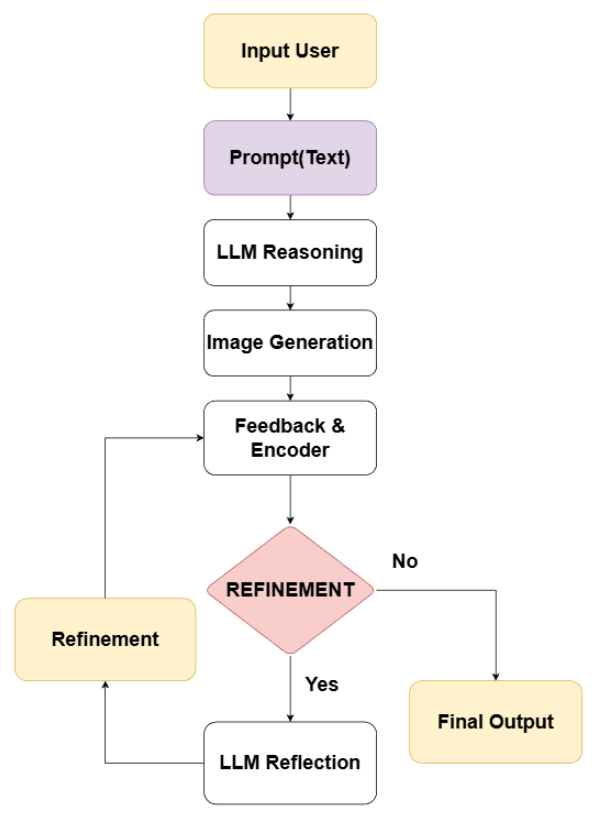
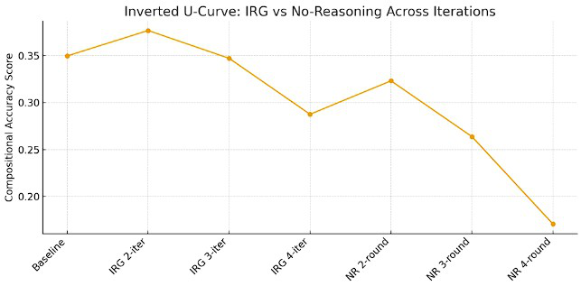
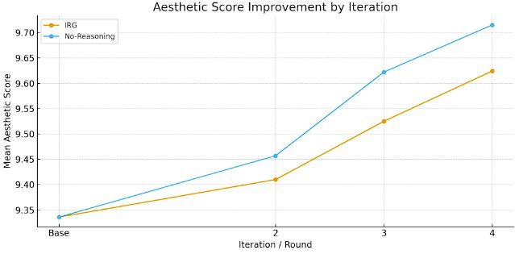
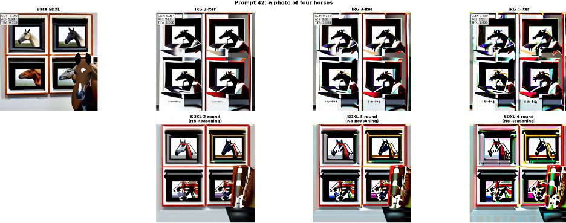

# Modular Interleaving Reasoning-Generation (IRG) for Text-to-Image Synthesis

**An Academic Graduation Thesis Project**

---

## Abstract

Recent advancements in Large Language Models (LLMs) and Latent Diffusion Models (LDMs) have revolutionized text-to-image generation. However, achieving high compositional accuracy and prompt adherence remains a significant challenge for single-shot diffusion models. This thesis introduces the **Modular Interleaving Reasoning-Generation (IRG)** framework, a multi-round, closed-loop pipeline that integrates an autonomous reasoning agent to evaluate, diagnose, and incrementally refine generated images. 

Developed originally as a graduation thesis utilizing fine-tuned open-source models (Phase 1), the system has since evolved into a fully autonomous Multi-Agent architecture bounded by Retrieval-Augmented Generation (Phase 2). By leveraging statistical image features as analytical feedback, the framework functions as an automated art director, resulting in quantifiable improvements in complex compositional tasks and overall aesthetic fidelity.

---

## 1. System Architecture & Methodology

The core innovation of the IRG pipeline is the transition from zero-shot prompt execution to an iterative **Think → Generate → Reflect → Refine** feedback loop. To facilitate ongoing research, the repository maintains the codebase for both the foundational thesis implementation and its subsequent architectural evolution.

### 1.1 Phase 1: The Thesis Implementation (Qwen-IRG)
The academic foundation of this project involved fine-tuning a small-parameter LLM to perform complex visual diagnostics on consumer-grade hardware.
* **Feature-Aware Diagnostics**: The system simulates multimodal understanding by translating CLIP-extracted feature statistics (mean, variance, highlights) into textual formatting that the LLM can interpret.
* **Low-Rank Adaptation (LoRA)**: A Qwen-2.5 3B model was aggressively fine-tuned on a custom pipeline of 4,000 synthetic reasoning traces to master object decomposition, spatial reasoning, and attribute binding.
* **Adaptive Denoising**: Implementing a dynamically decaying denoising schedule mapped with linearly increasing guidance scales to prevent over-refinement and semantic drift during the Image-to-Image inference phase.


*(Figure 1: The directed graphical model of the Interleaving Reasoning-Generation diffusion process, illustrating the deterministic multi-round feedback cycle.)*

### 1.2 Phase 2: Autonomous Pipeline Evolution (Gemini-IRG)
Following the completion of the thesis, the architecture was elevated to overcome the contextual limitations of small-parameter models:
* **LLM Orchestration**: Transitioned the reasoning engine to Google's Gemini, introducing advanced heuristic parsing and regex-bound output schemas.
* **Retrieval-Augmented Generation (RAG)**: Developed a historical retrieval service to inject successful textual refinement trajectories as grounded few-shot context, heavily stabilizing the corrective output.

---

## 2. Experimental Results and Evaluation

The proposed framework was subjected to rigorous empirical evaluation across a stratified benchmark of compositionally demanding prompts (counting, spatial relations, attribute binding).

### 2.1 Quantitative Analysis
Performance was benchmarked against the standard single-point execution of Stable Diffusion XL. 
* **Compositional Accuracy**: Under an object detection-based composite score, the 2-iteration interleaving reasoning loop achieved a maximal **+7.74% improvement** (from 0.3497 to 0.3768) over the base model.
* **Visual Fidelity**: Contrary to the semantic alignment metric which experienced slight monotonic degradation due to successive denoising, human-aligned aesthetic scores exhibited a monotonic improvement, peaking at a **+3.08% enhancement** by the fourth iteration.

<div style="display: flex; justify-content: space-between;">
    
    
</div>
*(Figure 2: Empirical analysis of compositional accuracy (left) and aesthetic quality (right) across progressive refinement iterations.)*

### 2.2 Qualitative Analysis
Qualitative evaluation confirms the quantitative metrics, explicitly demonstrating the model's capacity to recognize attribute leakage prior to regeneration, specifically in counting tasks and spatial positioning.


*(Figure 3: Multi-iteration structural correction, demonstrating successful counting logic resolution over progressive refinement cycles.)*

---

## 3. Repository Organization

The repository is modularly structured to separate the Jupyter-based research environment from the productionized V2 architecture.

```text
IRG-Thesis/
├── Workflow-CODE/                 # Academic Phase 1 (Data Synthesis & Training)
│   ├── irg-1-dataset-generation.ipynb  # Synthetic reasoning data generation
│   ├── irg-2-qwen-finetuning.ipynb     # PEFT/LoRA configuration and training
│   ├── irg-imagegeneration.ipynb       # Baseline inference procedures
│   ├── phase3-benchmark.ipynb          # GenEval benchmarking and metric calculation
│   └── Final_check_2.pdf               # Complete official thesis documentation
│
├── src/                           # Production Phase 2 (Autonomous Multi-Agent)
│   ├── core/workflow.py                # System orchestrator and cyclical control
│   ├── agents/expert_agent.py          # LLM interface and diagnostic heuristics
│   ├── services/rag_service.py         # Vector context retrieval
│   └── services/image_service.py       # SDXL API execution and feature extraction
│
├── .gitignore
├── requirements.txt
└── main.py                        # Entry point for the Phase 2 autonomous pipeline
```

---

## 4. Setup and Reproduction Environment

### 4.1 Prerequisites
Experiments documented in this thesis were accelerated utilizing dual NVIDIA Tesla T4 GPUs on an Ubuntu 20.04.5 LTS environment, utilizing CUDA 12.1.
* Python >= 3.10
* PyTorch 2.1.0

### 4.2 Installation
A virtual environment is strongly recommended.
```bash
# Clone the repository
git clone https://github.com/[your-username]/IRG-Thesis.git
cd IRG-Thesis

# Install core dependencies
pip install -r requirements.txt

# For Phase 1 (LoRA Fine-tuning) specific acceleration:
pip install torch torchvision torchaudio --index-url https://download.pytorch.org/whl/cu121
pip install transformers peft accelerate datasets bitsandbytes
```

### 4.3 Execution Details
* **Phase 1 Replication**: Proceed to `Workflow-CODE/` and execute sequence notebooks `1` through `3`. Ensure sufficient VRAM (16GB+) for 4-bit quantized Qwen-2.5-3B and FP16 SDXL coexistence.
* **Phase 2 Execution**: Define `.env` with variables `GEMINI_API_KEY` and `STABILITY_API_KEY`. Execute `python main.py`.

---

## Acknowledgments

This research implementation heavily references the mathematical foundations of Latent Diffusion Models and draws architectural inspiration from contemporary Interleaved Visual-Language frameworks. Special acknowledgment to FPT University for hardware provisions and faculty guidance.

## Disclaimer & License

This source code is provisioned for strictly academic, non-commercial research purposes under the Creative Commons Attribution-NonCommercial 4.0 International License.

Copyright (c) 2025 Ngô Anh Dũng.
